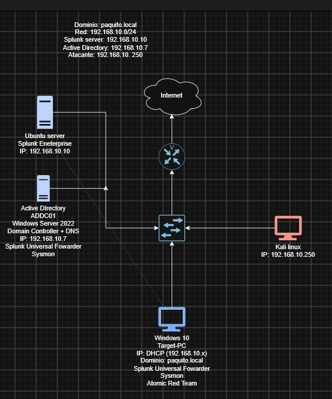
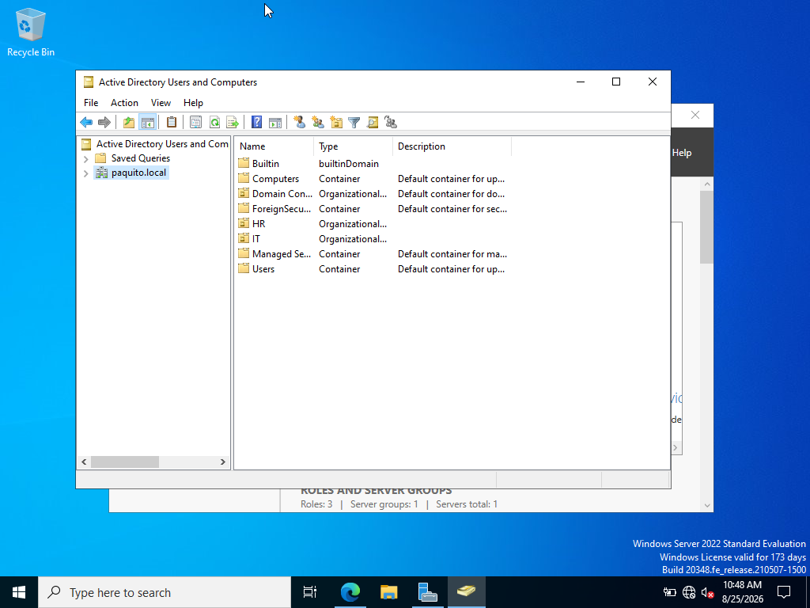
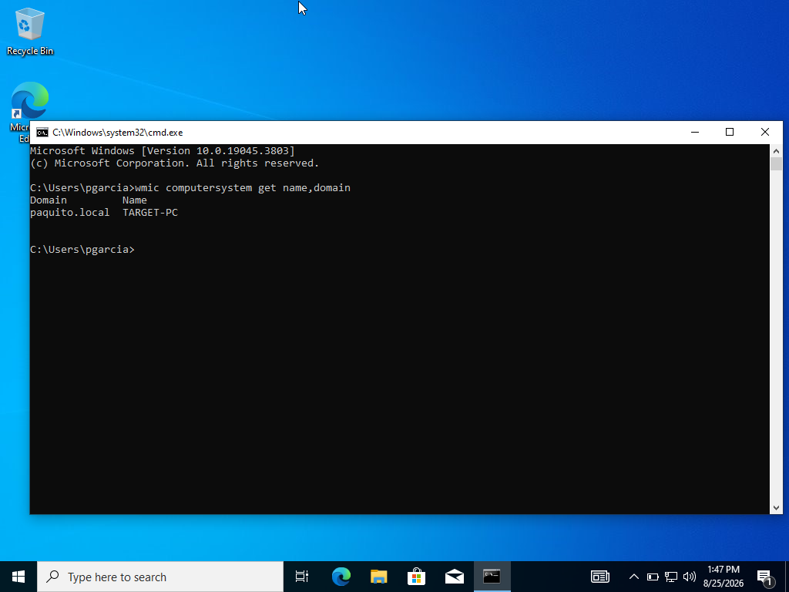
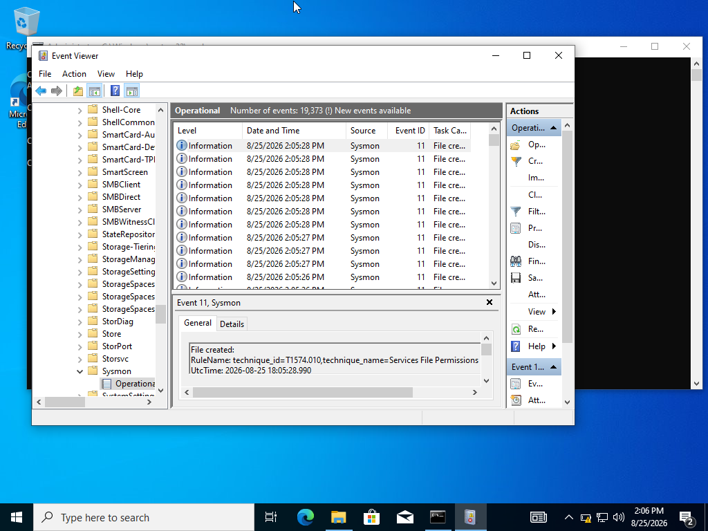
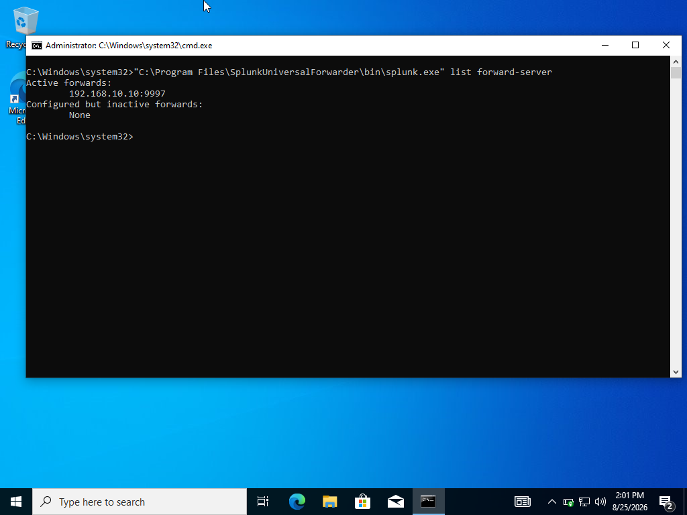
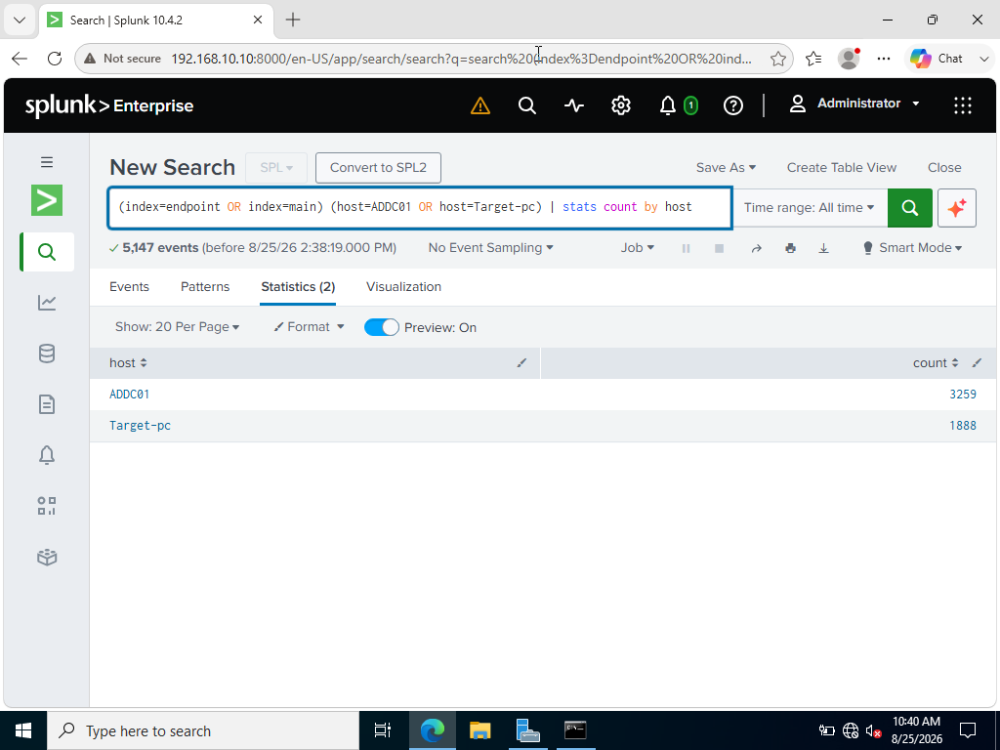

# Laboratorio de Active Directory + Splunk SIEM

## Objetivo

El objetivo de este proyecto es construir un laboratorio controlado de ciberseguridad integrando Active Directory, Sysmon y Splunk Enterprise.

El entorno simula una pequeña red empresarial en la que distintos sistemas Windows generan telemetría de seguridad que es enviada a un SIEM centralizado para su monitoreo y análisis.

Actualmente, el laboratorio cuenta con un servidor Windows funcionando como Controlador de Dominio, una máquina Windows 10 Pro unida al dominio, Sysmon para generar telemetría avanzada y Splunk Universal Forwarder para centralizar los registros en Splunk Enterprise.

En la siguiente fase del proyecto se utilizará Kali Linux para generar actividad controlada contra la máquina objetivo y analizar posteriormente los eventos generados dentro de Splunk.

### Habilidades aprendidas

- Configuración y administración de un entorno de Active Directory.
- Instalación y configuración de Splunk Enterprise como SIEM.
- Instalación y configuración de Splunk Universal Forwarder.
- Recolección de eventos de Windows y telemetría de Sysmon.
- Configuración de comunicación entre endpoints Windows y un SIEM centralizado.
- Configuración de direcciones IP estáticas, DNS y DHCP.
- Integración de equipos Windows a un dominio de Active Directory.
- Resolución de problemas de red y envío de logs.
- Análisis básico de eventos mediante Splunk Search Processing Language (SPL).
- Administración básica de Windows Server y Ubuntu Server.

### Herramientas utilizadas

- **Splunk Enterprise:** recepción, búsqueda y análisis centralizado de eventos.
- **Splunk Universal Forwarder:** envío de registros desde los equipos Windows hacia Splunk.
- **Sysmon:** generación de telemetría avanzada en sistemas Windows.
- **Windows Server 2022:** Active Directory Domain Services y DNS.
- **Windows 10 Pro:** endpoint monitoreado y máquina objetivo.
- **Ubuntu Server:** sistema utilizado para alojar Splunk Enterprise.
- **Kali Linux:** máquina destinada a futuras pruebas controladas.
- **Oracle VirtualBox:** plataforma de virtualización utilizada para construir el laboratorio.

## Pasos

### 1. Arquitectura del laboratorio

El entorno fue construido utilizando Oracle VirtualBox y una red virtual compartida entre las máquinas.

| Sistema | Función | Dirección IP |
|---|---|---|
| Ubuntu Server | Splunk Enterprise | 192.168.10.10 |
| Windows Server 2022 | Controlador de Dominio / DNS | 192.168.10.7 |
| Windows 10 Pro | Target-PC / Endpoint del dominio | DHCP |
| Kali Linux | Simulación de actividad | 192.168.10.250 |

---

### 2. Instalación de Splunk Enterprise

Splunk Enterprise fue instalado sobre Ubuntu Server para funcionar como SIEM centralizado.

El servidor fue configurado con la dirección IP estática:

`192.168.10.10`

Además, Splunk fue configurado para recibir eventos provenientes de Splunk Universal Forwarder mediante el puerto:

`9997`

*Ref. 2: Splunk Enterprise ejecutándose sobre Ubuntu Server.*

---

### 3. Configuración de Active Directory

Windows Server 2022 fue configurado con la dirección IP estática:

`192.168.10.7`

Posteriormente se instaló Active Directory Domain Services junto con DNS y el servidor fue promovido a Controlador de Dominio.

Dominio configurado:

`paquito.local`

---

### 4. Configuración del endpoint

Se instaló Windows 10 Pro como máquina objetivo del laboratorio.

El endpoint fue configurado para utilizar como servidor DNS al Controlador de Dominio:

`192.168.10.7`

Posteriormente, `Target-PC` fue unido correctamente al dominio:

`paquito.local`

*Target-PC unido correctamente al dominio paquito.local.*

Esto permite autenticar usuarios creados desde Active Directory directamente en la máquina objetivo.

---

### 5. Configuración de Sysmon

Sysmon fue instalado tanto en Windows Server como en Windows 10 Pro para aumentar la visibilidad sobre la actividad de los endpoints.

Sysmon permite registrar eventos relacionados con:

- Creación de procesos.
- Conexiones de red.
- Actividad del registro de Windows.
- Archivos y procesos del sistema.
- Otros eventos relevantes para análisis de seguridad.

*Sysmon generando eventos de telemetría en Target-PC mediante el registro Operational.*

---
### 6. Splunk Universal Forwarder

Splunk Universal Forwarder fue instalado en:

- Windows Server 2022.
- Windows 10 Pro / Target-PC.

Ambos sistemas fueron configurados para enviar eventos hacia:

`192.168.10.10:9997`

*Splunk Universal Forwarder de Target-PC conectado correctamente a 192.168.10.10:9997.*
---

### 7. Recolección de eventos de Windows

El endpoint Windows fue configurado para enviar distintos registros hacia Splunk.

Configuración utilizada:

    [WinEventLog://Application]
    index = endpoint
    disabled = false

    [WinEventLog://Security]
    index = endpoint
    disabled = false

    [WinEventLog://System]
    index = endpoint
    disabled = false

    [WinEventLog://Microsoft-Windows-Sysmon/Operational]
    index = endpoint
    disabled = false
    renderXml = true

Esta configuración permite centralizar eventos de Windows y Sysmon dentro de Splunk.

*Ref. 7: Configuración del archivo inputs.conf.*

---

### 8. Verificación en Splunk

Se confirmó que Splunk estaba recibiendo información proveniente de ambos sistemas Windows.

Consulta SPL utilizada:

    index=endpoint OR index=main
    | stats count by host

Splunk mostró correctamente los siguientes hosts:

- `ADDC01`
- `Target-pc`

Esto confirma que ambos equipos están generando y enviando telemetría hacia el SIEM.

---

### 9. Problemas resueltos durante la implementación

Durante la construcción del laboratorio se presentaron distintos problemas que requirieron diagnóstico y solución:

- Conflicto entre DHCP y la dirección IP estática de Ubuntu Server.
- Cloud-init reactivando DHCP después de reiniciar Ubuntu.
- Windows 10 Home no permitía unir el equipo a un dominio de Active Directory.
- Migración de la máquina objetivo a Windows 10 Pro.
- Problemas de permisos de Splunk Universal Forwarder para leer Windows Event Logs.
- Configuración de `inputs.conf` y `outputs.conf`.
- Problemas de comunicación entre máquinas virtuales.
- Configuración de DNS necesaria para resolver correctamente el dominio.
- Configuración del puerto `9997` para recepción de eventos.
- Integración de Sysmon con Splunk Universal Forwarder.

La resolución de estos problemas permitió adquirir experiencia práctica en troubleshooting de redes, Windows, Linux, Active Directory y plataformas SIEM.

## Próximos pasos

- Configurar Kali Linux dentro del laboratorio.
- Generar actividad controlada contra Target-PC.
- Simular múltiples intentos fallidos de autenticación.
- Analizar los eventos generados en Splunk.
- Identificar eventos de autenticación fallida.
- Crear consultas SPL orientadas a detección.
- Crear una regla básica para detectar posibles intentos de fuerza bruta.
- Documentar el escenario de ataque y detección.
