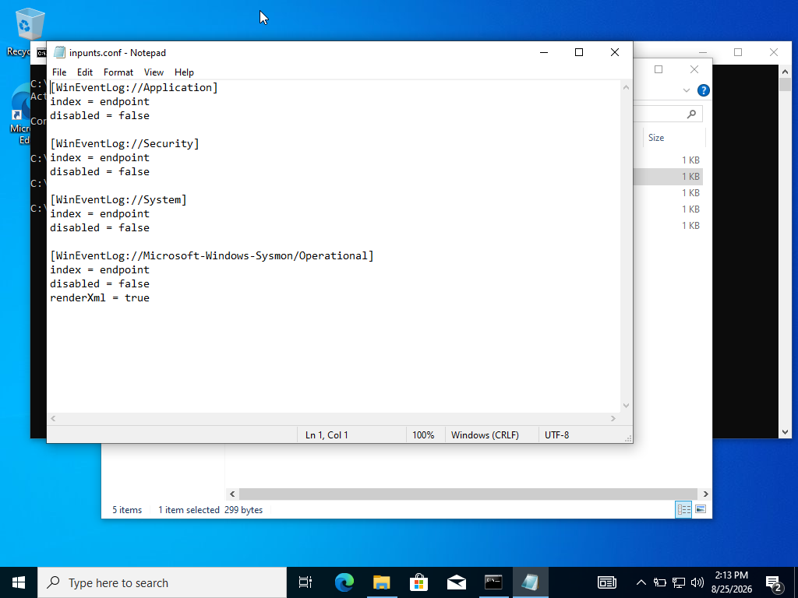
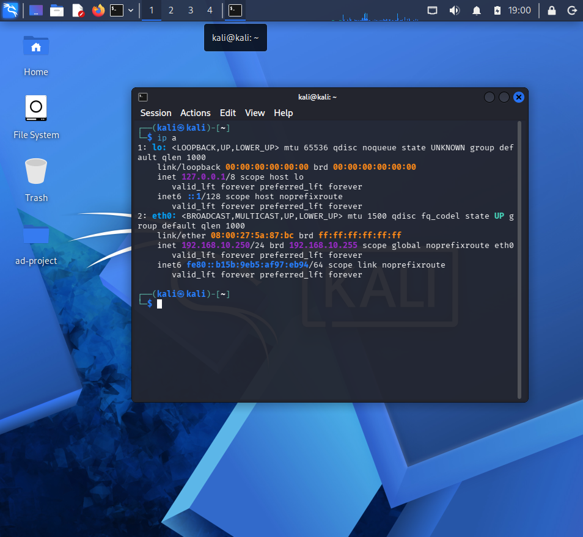
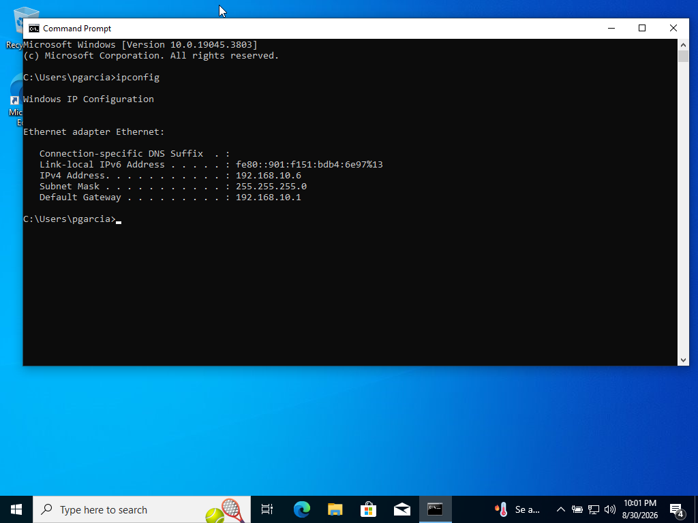
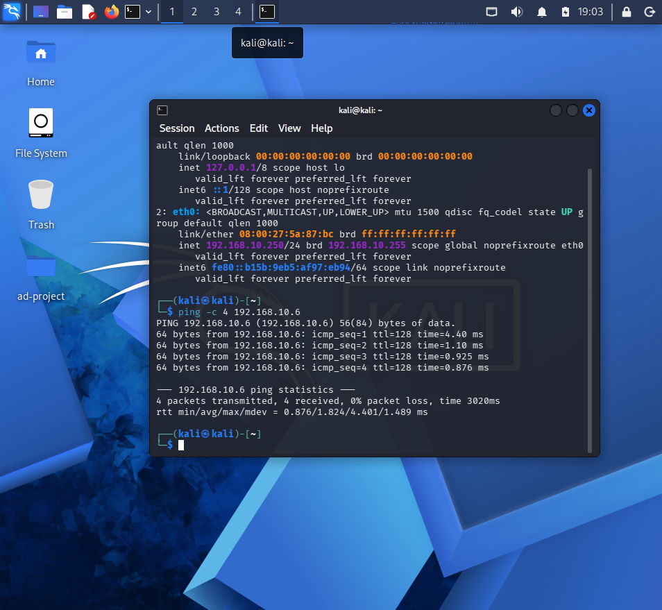
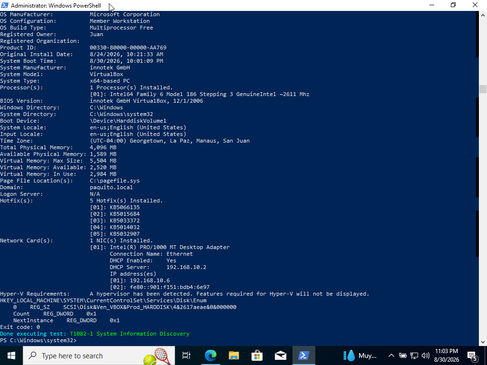
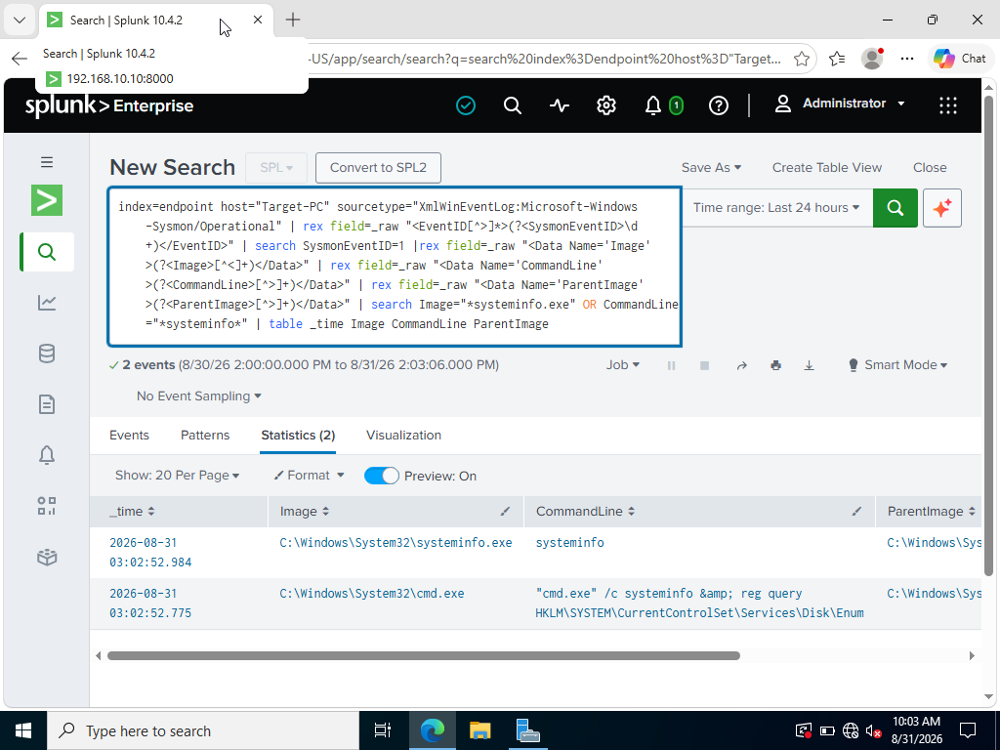
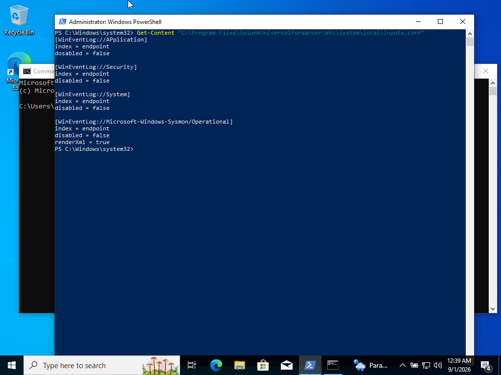
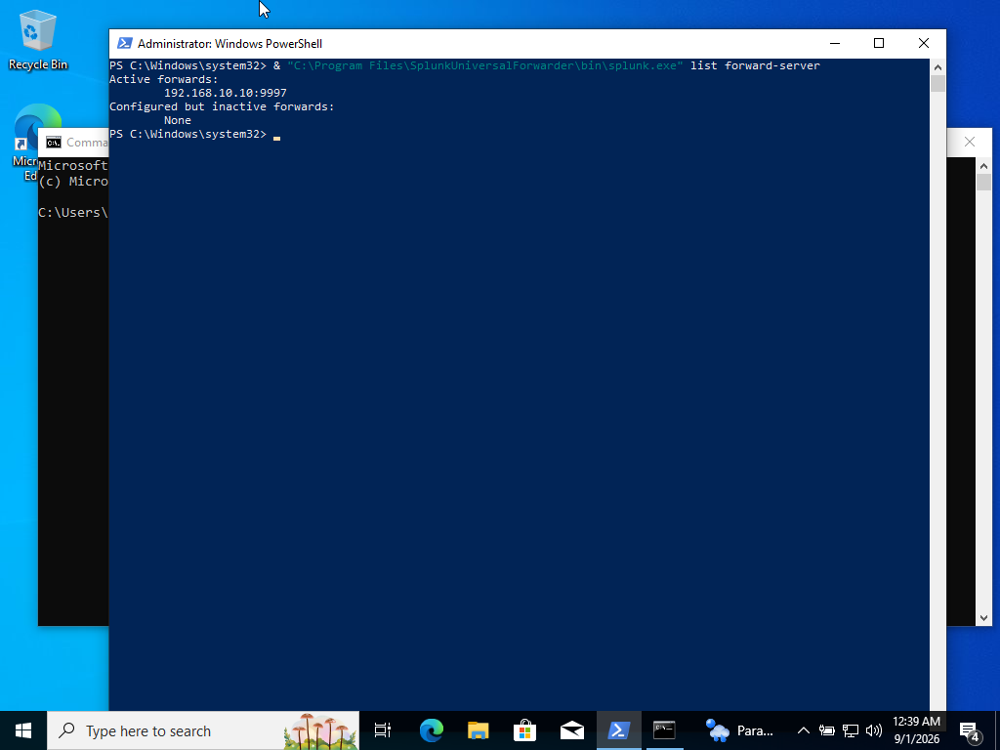
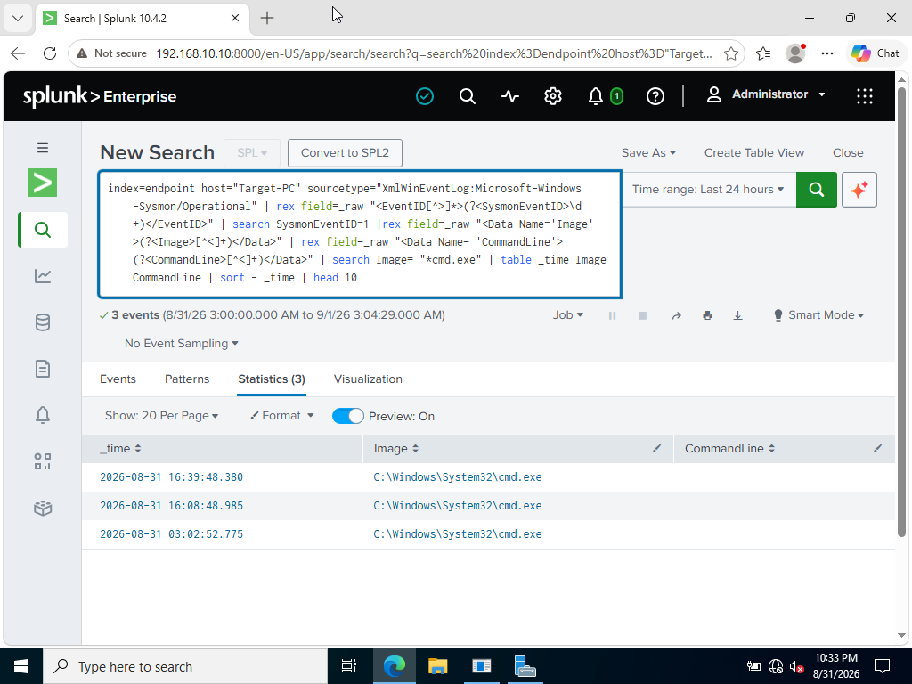

# Laboratorio de Active Directory + Splunk SIEM

## Objetivo

El objetivo de este proyecto es construir un laboratorio controlado de ciberseguridad integrando Active Directory, Sysmon, Splunk Enterprise y Atomic Red Team.

El entorno simula una pequeña red empresarial en la que distintos sistemas Windows generan telemetría de seguridad que es enviada a un SIEM centralizado para su monitoreo y análisis.

El laboratorio cuenta con un servidor Windows Server 2022 funcionando como Controlador de Dominio y servidor DNS, una máquina Windows 10 Pro unida al dominio, Sysmon para generar telemetría avanzada y Splunk Universal Forwarder para centralizar los registros en Splunk Enterprise.

También se incorporó Kali Linux como máquina destinada a pruebas controladas y Atomic Red Team en `Target-PC` para generar actividad basada en técnicas de MITRE ATT&CK.

Como primera simulación se ejecutó la técnica `T1082 - System Information Discovery`. La actividad generada fue registrada por Sysmon y posteriormente identificada en Splunk mediante consultas SPL.

### Habilidades aprendidas

- Configuración y administración de un entorno de Active Directory.
- Instalación y configuración de Splunk Enterprise como SIEM.
- Instalación y configuración de Splunk Universal Forwarder.
- Recolección de eventos de Windows y telemetría de Sysmon.
- Configuración de comunicación entre endpoints Windows y un SIEM centralizado.
- Configuración de direcciones IP estáticas, DNS y DHCP.
- Integración de equipos Windows a un dominio de Active Directory.
- Resolución de problemas de red y envío de logs.
- Análisis de eventos mediante Splunk Search Processing Language (SPL).
- Administración básica de Windows Server y Ubuntu Server.
- Ejecución de simulaciones controladas mediante Atomic Red Team.
- Identificación de técnicas MITRE ATT&CK mediante telemetría de Sysmon.
- Extracción y análisis de campos XML utilizando `rex` en consultas SPL.
- Troubleshooting de problemas de ingestión de eventos en Splunk.

### Herramientas utilizadas

- **Splunk Enterprise:** recepción, búsqueda y análisis centralizado de eventos.
- **Splunk Universal Forwarder:** envío de registros desde los equipos Windows hacia Splunk.
- **Sysmon:** generación de telemetría avanzada en sistemas Windows.
- **Atomic Red Team:** framework utilizado para generar actividad controlada basada en técnicas de MITRE ATT&CK.
- **Windows Server 2022:** Active Directory Domain Services y DNS.
- **Windows 10 Pro:** endpoint monitoreado y máquina objetivo.
- **Ubuntu Server:** sistema utilizado para alojar Splunk Enterprise.
- **Kali Linux:** máquina destinada a realizar pruebas controladas dentro del laboratorio.
- **Oracle VirtualBox:** plataforma de virtualización utilizada para construir el laboratorio.

---

## Pasos

### 1. Arquitectura del laboratorio

El entorno fue construido utilizando Oracle VirtualBox y una red virtual compartida entre las máquinas.


| Sistema | Función | Dirección IP |
|---|---|---|
| Ubuntu Server | Splunk Enterprise | 192.168.10.10 |
| Windows Server 2022 | Controlador de Dominio / DNS | 192.168.10.7 |
| Windows 10 Pro | Target-PC / Endpoint del dominio | DHCP |
| Kali Linux | Máquina para pruebas controladas | 192.168.10.250 |

---

### 2. Instalación de Splunk Enterprise

Splunk Enterprise fue instalado sobre Ubuntu Server para funcionar como SIEM centralizado.

El servidor fue configurado con la dirección IP estática:

`192.168.10.10`

Splunk Enterprise utiliza su interfaz web para realizar búsquedas y análisis de eventos.

Además, el servidor fue configurado para recibir eventos provenientes de Splunk Universal Forwarder mediante el puerto:

`9997`

---

### 3. Configuración de Active Directory

Windows Server 2022 fue configurado con la dirección IP estática:

`192.168.10.7`

Posteriormente se instalaron Active Directory Domain Services y DNS, y el servidor fue promovido a Controlador de Dominio.

Dominio configurado:

`paquito.local`


*Dominio `paquito.local` configurado en Active Directory.*

---

### 4. Configuración del endpoint

Se instaló Windows 10 Pro como máquina objetivo del laboratorio.

El endpoint fue configurado para utilizar como servidor DNS al Controlador de Dominio:

`192.168.10.7`

Posteriormente, `Target-PC` fue unido correctamente al dominio:

`paquito.local`


*Target-PC unido correctamente al dominio `paquito.local`.*

Esto permite autenticar usuarios creados desde Active Directory directamente en la máquina objetivo.

---

### 5. Configuración de Sysmon

Sysmon fue instalado tanto en Windows Server 2022 como en Windows 10 Pro para aumentar la visibilidad sobre la actividad de los endpoints.

Sysmon permite registrar eventos relacionados con:

- Creación de procesos.
- Conexiones de red.
- Actividad del registro de Windows.
- Creación y modificación de archivos.
- Otros eventos relevantes para análisis de seguridad.


*Sysmon generando eventos de telemetría en Target-PC mediante el registro Operational.*

---

### 6. Splunk Universal Forwarder

Splunk Universal Forwarder fue instalado en:

- Windows Server 2022.
- Windows 10 Pro / `Target-PC`.

Ambos sistemas fueron configurados para enviar eventos hacia:

`192.168.10.10:9997`


*Splunk Universal Forwarder de Target-PC conectado correctamente a `192.168.10.10:9997`.*

---

### 7. Recolección de eventos de Windows

El endpoint Windows fue configurado para enviar diferentes registros hacia Splunk.

Configuración utilizada:

```ini
[WinEventLog://Application]
index = endpoint
disabled = false

[WinEventLog://Security]
index = endpoint
disabled = false

[WinEventLog://System]
index = endpoint
disabled = false

[WinEventLog://Microsoft-Windows-Sysmon/Operational]
index = endpoint
disabled = false
renderXml = true
```



*Configuración de `inputs.conf` utilizada para recolectar eventos de Windows y Sysmon.*

Esta configuración permite centralizar eventos de Windows y Sysmon dentro de Splunk.

---

### 8. Verificación en Splunk

Se confirmó que Splunk estaba recibiendo información proveniente de ambos sistemas Windows.

Consulta SPL utilizada:

```spl
index=endpoint OR index=main
| stats count by host
```

Splunk mostró correctamente los siguientes hosts:

- `ADDC01`
- `Target-PC`


*Verificación de los hosts Windows enviando eventos hacia Splunk.*

Esto confirmó que ambos equipos estaban generando y enviando telemetría hacia el SIEM.

---

### 9. Configuración de Kali Linux

Kali Linux fue configurado como la máquina destinada a realizar pruebas controladas dentro del laboratorio.

Se configuró una dirección IP estática dentro de la misma red virtual utilizada por los demás sistemas.

Configuración utilizada:

- **Dirección IP:** `192.168.10.250/24`
- **Gateway:** `192.168.10.1`
- **DNS:** `8.8.8.8`

Para verificar la configuración de red se utilizó:

```bash
ip a
```



*Configuración de red de Kali Linux con la dirección IP estática `192.168.10.250`.*

La máquina `Target-PC` obtuvo mediante DHCP la dirección:

`192.168.10.6`



*Dirección IP asignada a Target-PC dentro de la red del laboratorio.*

Posteriormente, se realizó una prueba de conectividad desde Kali Linux hacia Target-PC:

```bash
ping -c 4 192.168.10.6
```

El resultado mostró:

- 4 paquetes transmitidos.
- 4 paquetes recibidos.
- 0% de pérdida de paquetes.



*Prueba de conectividad exitosa desde Kali Linux hacia Target-PC.*

Esto confirmó que ambas máquinas pueden comunicarse correctamente dentro de la red `192.168.10.0/24`.

---

### 10. Instalación y preparación de Atomic Red Team

Para generar actividad de seguridad de forma controlada dentro del endpoint, se instaló **Atomic Red Team** en `Target-PC`.

Se creó una carpeta específica para almacenar sus componentes:

```powershell
New-Item -ItemType Directory -Path "C:\AtomicRedTeam" -Force
```

Para evitar que Microsoft Defender interfiriera con los archivos utilizados durante las simulaciones, se agregó únicamente esta carpeta como exclusión:

```powershell
Add-MpPreference -ExclusionPath "C:\AtomicRedTeam"
```

Posteriormente se instalaron los módulos necesarios de PowerShell:

```powershell
Install-Module -Name invoke-atomicredteam,powershell-yaml -Scope CurrentUser
```

La instalación fue verificada mediante:

```powershell
Get-Module -ListAvailable invoke-atomicredteam
```

También fue necesario permitir la ejecución de scripts para el usuario actual:

```powershell
Set-ExecutionPolicy RemoteSigned -Scope CurrentUser
```

Finalmente, los Atomics fueron descargados en:

```text
C:\AtomicRedTeam\atomics
```

Con esto, `Target-PC` quedó preparado para ejecutar simulaciones controladas basadas en técnicas de **MITRE ATT&CK**.

---

### 11. Ejecución de Atomic Red Team - T1082

Como primera simulación controlada se seleccionó:

`T1082 - System Information Discovery`

Esta técnica representa la recopilación de información sobre el sistema.

Primero se visualizaron las pruebas disponibles:

```powershell
Invoke-AtomicTest T1082 -ShowDetailsBrief
```

Posteriormente se verificaron los prerrequisitos del test número 1:

```powershell
Invoke-AtomicTest T1082 -TestNumbers 1 -CheckPrereqs
```

Los prerrequisitos fueron cumplidos correctamente.

La prueba fue ejecutada mediante:

```powershell
Invoke-AtomicTest T1082 -TestNumbers 1
```

Durante la simulación se ejecutaron comandos destinados a obtener información del sistema, incluyendo:

```text
systeminfo
```

y consultas al registro de Windows.



*Ejecución exitosa del test T1082-1 System Information Discovery mediante Atomic Red Team.*

El test terminó correctamente con código de salida `0`.

---

### 12. Detección de la actividad en Splunk

La actividad generada por Atomic Red Team fue registrada por Sysmon y posteriormente enviada hacia Splunk mediante Splunk Universal Forwarder.

Los eventos de Sysmon estaban siendo almacenados utilizando el siguiente sourcetype:

```text
XmlWinEventLog:Microsoft-Windows-Sysmon/Operational
```

Debido a que los eventos llegaban en formato XML, se utilizó `rex` dentro de SPL para extraer campos relevantes directamente desde `_raw`.

La siguiente consulta permitió identificar eventos de creación de procesos de Sysmon y localizar la ejecución de `systeminfo.exe`:

```spl
index=endpoint host="Target-PC" sourcetype="XmlWinEventLog:Microsoft-Windows-Sysmon/Operational"
| rex field=_raw "<EventID[^>]*>(?<SysmonEventID>\d+)</EventID>"
| search SysmonEventID=1
| rex field=_raw "<Data Name='Image'>(?<Image>[^<]+)</Data>"
| rex field=_raw "<Data Name='CommandLine'>(?<CommandLine>[^<]+)</Data>"
| rex field=_raw "<Data Name='ParentImage'>(?<ParentImage>[^<]+)</Data>"
| search Image="*systeminfo.exe" OR CommandLine="*systeminfo*"
| table _time Image CommandLine ParentImage
```

La búsqueda permitió identificar:

```text
C:\Windows\System32\systeminfo.exe
```

También fue posible observar la línea de comandos y el proceso padre asociado a la actividad.



*Detección en Splunk de los procesos generados durante la ejecución del Atomic Test T1082-1.*

Esta prueba permitió validar el siguiente flujo:

```text
Atomic Red Team
      ↓
Target-PC
      ↓
Sysmon
      ↓
Splunk Universal Forwarder
      ↓
Splunk Enterprise
      ↓
Consulta SPL
```

De esta forma se comprobó que una actividad generada de manera controlada en el endpoint puede ser registrada, centralizada y posteriormente identificada desde el SIEM.

---

### 13. Troubleshooting de Splunk Universal Forwarder

Durante las pruebas se detectó que Splunk tenía eventos históricos de `Target-PC`, pero no estaba recibiendo nuevos eventos.

Se verificó inicialmente que el servicio de Splunk Universal Forwarder se encontraba activo:

```powershell
Get-Service SplunkForwarder
```

También se confirmó que el servidor configurado como destino seguía activo:

```text
192.168.10.10:9997
```

Sin embargo, mediante `btool` se identificó que los inputs personalizados de Windows Event Logs no estaban siendo cargados.

Se recreó el archivo:

```text
C:\Program Files\SplunkUniversalForwarder\etc\system\local\inputs.conf
```

utilizando la siguiente configuración:

```ini
[WinEventLog://Application]
index = endpoint
disabled = false

[WinEventLog://Security]
index = endpoint
disabled = false

[WinEventLog://System]
index = endpoint
disabled = false

[WinEventLog://Microsoft-Windows-Sysmon/Operational]
index = endpoint
disabled = false
renderXml = true
```



*Configuración utilizada por Splunk Universal Forwarder para recolectar Windows Event Logs y eventos de Sysmon.*

Posteriormente se reinició el servicio:

```powershell
Restart-Service SplunkForwarder
```

La configuración activa fue comprobada mediante:

```powershell
& "C:\Program Files\SplunkUniversalForwarder\bin\splunk.exe" btool inputs list --debug
```

También se verificó nuevamente la conexión con el servidor Splunk:

```powershell
& "C:\Program Files\SplunkUniversalForwarder\bin\splunk.exe" list forward-server
```



*Splunk Universal Forwarder conectado activamente al servidor `192.168.10.10` mediante el puerto `9997`.*

Después de aplicar la corrección, Splunk comenzó nuevamente a recibir eventos recientes provenientes de `Target-PC`.

---

### 14. Validación final del flujo de telemetría

Para comprobar que Sysmon y Splunk Universal Forwarder continuaban funcionando correctamente después del troubleshooting, se generó una nueva ejecución de `cmd.exe` en `Target-PC`.

Sysmon registró localmente el proceso mediante:

`Event ID 1 - Process Create`

Posteriormente se utilizó la siguiente consulta en Splunk:

```spl
index=endpoint host="Target-PC" sourcetype="XmlWinEventLog:Microsoft-Windows-Sysmon/Operational"
| rex field=_raw "<EventID[^>]*>(?<SysmonEventID>\d+)</EventID>"
| search SysmonEventID=1
| rex field=_raw "<Data Name='Image'>(?<Image>[^<]+)</Data>"
| rex field=_raw "<Data Name='CommandLine'>(?<CommandLine>[^<]+)</Data>"
| search Image="*cmd.exe"
| table _time Image CommandLine
| sort - _time
| head 10
```

Splunk identificó correctamente ejecuciones de:

```text
C:\Windows\System32\cmd.exe
```



*Validación final de eventos de creación de procesos enviados desde Target-PC hacia Splunk.*

Esto permitió confirmar nuevamente el funcionamiento del flujo completo:

```text
Target-PC
   ↓
Sysmon
   ↓
Splunk Universal Forwarder
   ↓
192.168.10.10:9997
   ↓
Splunk Enterprise
   ↓
Análisis mediante SPL
```

---

### 15. Problemas resueltos durante la implementación

Durante la construcción y validación del laboratorio se presentaron distintos problemas que requirieron diagnóstico y solución:

- Conflicto entre DHCP y la dirección IP estática de Ubuntu Server.
- Cloud-init reactivando DHCP después de reiniciar Ubuntu.
- Windows 10 Home no permitía unir el equipo a Active Directory.
- Migración de la máquina objetivo a Windows 10 Pro.
- Configuración del DNS de Target-PC hacia el Controlador de Dominio.
- Problemas de comunicación entre máquinas virtuales.
- Configuración del puerto `9997` para recepción de eventos.
- Permisos necesarios para que Splunk Universal Forwarder pudiera acceder a Windows Event Logs.
- Configuración de `inputs.conf` y `outputs.conf`.
- Pérdida de los inputs personalizados de Windows Event Logs en Splunk Universal Forwarder.
- Verificación de la configuración efectiva mediante `btool`.
- Eventos de Sysmon almacenados en XML sin extracción automática de `EventID`.
- Extracción manual de campos utilizando `rex` en SPL.
- Configuración de PowerShell necesaria para utilizar Atomic Red Team.
- Integración y validación de Sysmon con Splunk Universal Forwarder.

La resolución de estos problemas permitió adquirir experiencia práctica en troubleshooting de Windows, Linux, redes, Active Directory, Sysmon, Splunk y sistemas SIEM.

---

## Resultados del laboratorio

Al finalizar esta fase del laboratorio se logró:

- Implementar un dominio de Active Directory funcional.
- Integrar un endpoint Windows 10 Pro al dominio `paquito.local`.
- Implementar Sysmon para obtener telemetría avanzada.
- Centralizar Windows Event Logs utilizando Splunk Universal Forwarder.
- Configurar Splunk Enterprise como plataforma SIEM.
- Configurar Kali Linux dentro de la misma infraestructura virtual.
- Instalar y preparar Atomic Red Team.
- Ejecutar una simulación basada en MITRE ATT&CK.
- Ejecutar exitosamente la técnica `T1082 - System Information Discovery`.
- Registrar la actividad generada mediante Sysmon.
- Identificar `systeminfo.exe` dentro de Splunk.
- Crear consultas SPL para analizar eventos XML de Sysmon.
- Validar el flujo de telemetría desde Target-PC hasta Splunk.
- Diagnosticar y resolver problemas reales de ingestión de logs.

El laboratorio demuestra un flujo básico de trabajo similar al utilizado en operaciones de seguridad:

```text
Generación de actividad
        ↓
Recolección de telemetría
        ↓
Centralización de eventos
        ↓
Búsqueda y análisis
        ↓
Identificación de actividad
```

---

## Próximos pasos

Como ampliación futura del laboratorio se pueden realizar las siguientes actividades:

- Ejecutar técnicas adicionales de Atomic Red Team.
- Generar múltiples intentos fallidos de autenticación contra el entorno de Active Directory.
- Analizar eventos de autenticación fallida en Windows.
- Crear consultas SPL orientadas a detectar posibles intentos de fuerza bruta.
- Crear alertas básicas dentro de Splunk.
- Correlacionar diferentes fuentes de eventos.
- Ampliar las simulaciones utilizando otras técnicas de MITRE ATT&CK.
